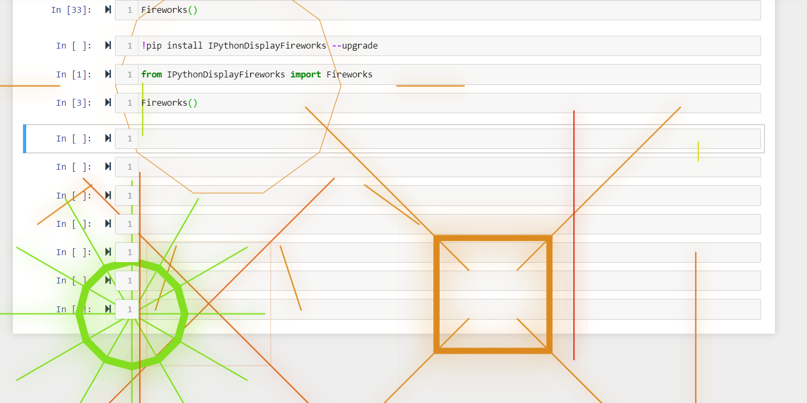

# IPythonDisplayFireworks
Some fancy full-screen firework effects for your jupyter notebooks, mainly implemented using IPython.display, IPython.HTML, Papers.js and TweenMax. 
Can be used with Jupyter Notebooks, and in places where ipywidgets are not supported. Only requires one way communication to work, so great for remote server cases.

Adapted from: https://codepen.io/zadvorsky/pen/FAmuL

How to install from a terminal/command prompt:

	pip install IPythonDisplayFireworks
	
To install from a jupyter notebook cell:

	!pip install IPythonDisplayFireworks

How to use:
```python
from IPythonDisplayFireworks import Fireworks
Fireworks()
```



[](https://mybinder.org/v2/gh/atahan-git/IPythonDisplayFireworks/master)